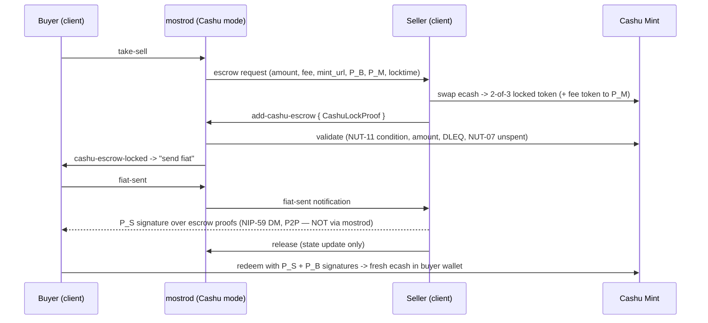
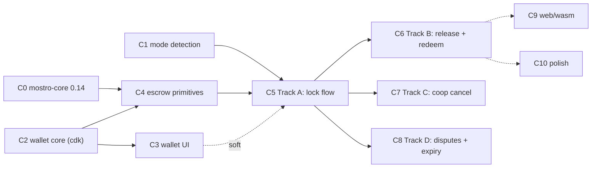

# Cashu Escrow — Client Implementation Spec & Phased Plan

**Status:** In progress — C0 merged (`mostro-core` 0.14 + wire form pinned); C1a in review
**Goal:** ship Cashu as a user-selectable settlement backend alongside Lightning — see §1.1
**Audience:** contributors implementing Cashu support in this client (appv2)
**Upstream reference:** [`MostroP2P/mostro` — Cashu escrow spec series](https://github.com/MostroP2P/mostro/tree/main/docs/cashu)

---

## 1. Goal

Add support for **Cashu escrow mode** to this client so that trades can be completed
against a `mostrod` node that runs in Cashu mode instead of Lightning mode, as specified
in the daemon-side spec series:

- [`docs/CASHU_ESCROW_ARCHITECTURE.md`](https://github.com/MostroP2P/mostro/blob/main/docs/CASHU_ESCROW_ARCHITECTURE.md) — architecture, trust model, 2-of-3 mechanism
- [`docs/cashu/README.md`](https://github.com/MostroP2P/mostro/blob/main/docs/cashu/README.md) — daemon roadmap (Foundation + Tracks A–D)
- [`docs/cashu/01-fundamentals.md`](https://github.com/MostroP2P/mostro/blob/main/docs/cashu/01-fundamentals.md) — config, `CashuClient`, DB, boot (CF-0…CF-5)
- [`docs/cashu/02-track-a-lock.md`](https://github.com/MostroP2P/mostro/blob/main/docs/cashu/02-track-a-lock.md) — escrow lock via `AddCashuEscrow`
- Tracks B (release), C (cooperative cancel), D (disputes) — planned upstream; this plan
  anticipates them from the architecture doc and must be re-checked when they are published.

### 1.1 What this is for — read this before planning anything

**The goal is a shipped product feature: Cashu escrow available to real users, in
`mostrod` and in this client, so that a user can choose whether to trade on a Mostro node
that settles over Cashu or one that settles over Lightning.** Both backends are
first-class and both are permanent. Cashu is not an experiment, and Lightning is not being
replaced.

Testing the daemon end-to-end is the **first milestone on the way there**, not the
destination. It is genuinely useful — as each daemon track lands, the client should have
the matching capability ready — but it is a checkpoint, and treating it as the finish line
produces the wrong calls at exactly the points where they are expensive to undo.

Concretely, the difference changes these decisions:

| If the goal were "test the daemon" | Because the goal is "users choose their node" |
|---|---|
| The embedded wallet only has to survive a test run | It holds **user funds**. Ecash is bearer: a lost wallet DB is lost money. Backup/restore is a **release requirement**, not Wave-4 polish |
| Errors can surface as raw markers to a developer | Every failure a user can reach needs a localized, actionable message and a way out |
| Web can say "Cashu not available" indefinitely | Web is a first-class target of this app. A Cashu node being unusable there means the user's node choice silently depends on their platform |
| The dev override is the way in | Users never see the override. **Detection must work off the node's own advertisement**, which makes the upstream 38385 tags (§4.1) a release blocker, not a convenience |
| One tester who already knows the trust model | The mint is a **new trust assumption** users did not have in Lightning mode. They must see which mint a node uses *before* trading, not after |
| Ship when the flows work | Ship when the flows work **and** funds are recoverable on every failure path — including "Mostro vanished" (locktime refund) and "user reinstalled the app" |

None of this changes the phase order in §6 — the dependency graph is unaffected. It changes
**which phases are optional**, which is why Wave 4 is no longer called "optional
hardening".

### Non-goals

- No general-purpose Cashu wallet product. The embedded wallet exists to fund/redeem
  escrows against the node's configured mint; anything beyond that is out of scope.
  This bounds the wallet's **feature set**, not its quality bar — within that scope it
  handles real money and is held to it.
- No per-order mint negotiation (upstream constraint: the daemon pins a single `mint_url`).
- No change of any kind to the Lightning flows. Cashu code is **additive and inert**
  unless the active Mostro node is in Cashu mode. Lightning stays fully supported: this is
  a choice offered to users, never a migration imposed on them.

---

## 2. Background — how Cashu escrow works (daemon spec summary)

In Cashu mode, `mostrod` never holds funds. Escrow is a Cashu token locked with a
**NUT-11 P2PK 2-of-3 spending condition** over three keys:

| Key | Who | Notes |
|-----|-----|-------|
| `P_B` | Buyer | **Per-order trade key** (never the identity key) |
| `P_S` | Seller | **Per-order trade key** |
| `P_M` | Mostro | Arbitrator key, used only in disputes |

Any 2 of the 3 signatures spend the token. A NUT-11 `locktime` (daemon default 15 days)
with `refund = [P_S]` lets the seller reclaim unilaterally after expiry, so funds can
never be permanently stuck.

Happy path (sell order, from the architecture doc):



Key client-relevant deltas vs Lightning mode:

| Lightning mode | Cashu mode |
|---|---|
| Seller pays a **hold invoice** (`pay-invoice` action carries bolt11) | Seller **locks a 2-of-3 token at the mint** and submits it with `add-cashu-escrow` |
| Buyer submits a **bolt11 / LN address** (`add-invoice`) | **No buyer invoice step at all** — buyer redeems the token directly at the end |
| Settlement happens daemon-side (settle hold invoice, pay buyer) | Settlement is **client-side**: seller's signature travels **P2P buyer↔seller over NIP-59**, buyer countersigns and swaps at the mint |
| Mostro fee skimmed from the payout | Seller funds a **separate fee token** (`2 * order.fee`, P2PK 1-of-1 to `P_M`) at lock time |
| Cancel/dispute resolved by daemon via LND | Cancel: buyer sends their signature P2P to seller. Dispute: winner receives `P_M` signature via `cashu-pm-signature` and redeems |

### Protocol surface (frozen in `mostro-core`)

Already published in `mostro-core` (Actions/Payloads since 0.13.x/0.14.0; this client is
on **0.13.1** and must upgrade to **≥ 0.14.0** for `CashuLockProof.fee_token`):

- **Actions:** `AddCashuEscrow` (seller → mostro), `CashuEscrowLocked` (mostro → parties),
  `CashuPmSignature` (mostro → dispute winner)
- **Payloads:**
  - `Payload::CashuLockProof { token, mint_url, buyer_pubkey, seller_pubkey, mostro_pubkey, fee_token: Option<String> }`
    (all pubkeys x-only hex; `fee_token` added in 0.14.0, `#[serde(default)]`)
  - `Payload::CashuSignatures(Vec<CashuProofSignature>)` with `{ secret, signature }` per proof
- **`CantDoReason`s:** `InvalidCashuToken`, `CashuMintUnavailable`, `InvalidMintUrl`,
  `CashuEscrowNotLocked`, `CashuSignatureMissing`

Wire message (rumor content of the NIP-44/Kind-14 transport). **Confirmed against
`mostro-core` 0.14.1 in Phase C0** and pinned by tests in
`rust/src/mostro/cashu_wire.rs`, so an upstream rename fails our suite instead of a live
trade: `Action` is `rename_all = "kebab-case"`, `Payload` is `rename_all = "snake_case"`
(hence the `cashu_lock_proof` discriminator), `CashuLockProof`'s field names are exactly
as written below, and `fee_token` is `skip_serializing_if = "Option::is_none"` — a node
charging no fee produces the pre-0.14 form byte-for-byte. The example below is accurate:

```json
{
  "order": {
    "version": 2,
    "id": "ede61c96-4c13-4519-bf3a-dcf7f1e9d842",
    "request_id": 981234,
    "trade_index": 7,
    "action": "add-cashu-escrow",
    "payload": {
      "cashu_lock_proof": {
        "token": "cashuBo2Ftd2h0dHBzOi8vbWludC5leGFtcGxlLmNvbaF0...",
        "mint_url": "https://mint.example.com",
        "buyer_pubkey": "9f3a...c1",
        "seller_pubkey": "77b2...9e",
        "mostro_pubkey": "dbe0...42",
        "fee_token": "cashuBo2Ftd2h0dHBzOi8vbWludC5leGFtcGxlLmNvbaF0..."
      }
    }
  }
}
```

And the NUT-11 secret the seller's wallet must construct for each escrow proof
(construction per Track A; `data = P_S`, refund path seller-only):

```json
["P2PK", {
  "nonce": "<random>",
  "data": "<P_S compressed hex>",
  "tags": [
    ["pubkeys", "<P_B compressed hex>", "<P_M compressed hex>"],
    ["n_sigs", "2"],
    ["sigflag", "SIG_INPUTS"],
    ["locktime", "<unix: now + escrow_locktime_days>"],
    ["refund", "<P_S compressed hex>"],
    ["n_sigs_refund", "1"]
  ]
}]
```

> **Key encoding note.** Nostr trade keys are x-only (32 bytes); Cashu P2PK uses
> compressed SEC1 keys (33 bytes). The daemon maps with
> `cashu_pubkey_from_xonly_hex` (prefix `02`). The client must apply the identical
> mapping and must use the **per-order trade key** derived at
> `rust/src/api/identity.rs` (`derive_trade_key`), never the identity key —
> this is a hard privacy requirement of the upstream spec.

---

## 3. Client design principles

1. **Off by default, inert until detected.** All Cashu code paths are gated behind the
   active node's escrow mode. Against a Lightning node (or an old daemon that predates
   the info tags) the app behaves byte-for-byte as today. This mirrors the daemon's own
   merge gate: *"every PR must merge without altering existing behavior while Cashu
   remains disabled."*
2. **No crypto in Dart** (repo golden rule). All Cashu operations — mint HTTP calls,
   token construction, NUT-11 conditions, signatures, redemption — live in Rust
   (`rust/src/cashu/`), built on the [`cdk`](https://github.com/cashubtc/cdk) crate.
   Dart gets only FRB view-models and commands.
3. **Additive persistence.** `TradeInfo` is stored as a JSON blob
   (`rust/src/api/types.rs`), so new `Option<...>` fields are migration-light. The cdk
   wallet gets its own storage; it never touches existing tables.
4. **Small, stacked-or-parallel PRs** (one phase = one PR), matching the repo workflow
   and the daemon's CF-0…CF-5 / Track A–D structure so client phases can be tested
   against the corresponding daemon track as it lands.
5. **Copy proven in-repo patterns**, not invent new ones:
   - Capability detection: the anti-abuse-bond tri-state parsed from Kind 38385 tags
     (`BondPolicy { unsupported, disabled, enabled }` in
     `lib/features/about/models/mostro_instance.dart`) and the `fetch_and_set_pow`
     fetch hook (`rust/src/api/nostr.rs`).
   - Native/WASM split: the NWC client's `#[cfg(target_arch = "wasm32")]` stub
     (`rust/src/nwc/client.rs`).
   - Request correlation: `PendingRequestKind` in `rust/src/api/orders.rs`.

---

## 4. Mode detection — "only when the node runs Cashu"

The client already fetches the daemon's **Kind 38385 instance-info event** (tag
`z = "info"`) via `fetch_mostro_instance_tags` (`rust/src/api/nostr.rs`) and parses it in
`MostroInstance.fromTags` (Dart). Today the event advertises LND parameters
(`lnd_version`, `hold_invoice_*`, …) and the bond policy — **nothing about Cashu yet**.

### 4.1 Upstream proposal (to be PR'd to `mostrod`)

Add these tags to the 38385 info event when the daemon boots in Cashu mode:

```
["escrow_mode", "cashu"]                      // absent or "lightning" => Lightning
["cashu_mint_url", "https://mint.example.com"]
["cashu_escrow_locktime_days", "15"]
["cashu_settlement_margin_days", "3"]          // Track B FiatSent guard
```

This is symmetric with what the daemon already publishes for LND and costs one small
upstream PR (tags come straight from `Settings::get_cashu()`).

### 4.2 Client-side representation

Tri-state, exactly like `BondPolicy`:

```rust
// rust/src/api/types.rs (sketch)
pub enum EscrowMode {
    Unknown,    // info event not fetched yet / old daemon without the tag
    Lightning,  // tag absent or "lightning"
    Cashu,      // tag "escrow_mode" == "cashu"
}
```

- Stored in a process-global (same pattern as `rust/src/mostro/pow.rs`), populated by
  extending `fetch_and_set_pow` into a `fetch_and_set_node_capabilities` that runs on
  relay-pool Online and after every `set_active_mostro_node` /
  `refresh_subscriptions_for_active_node`.
- Exposed to Dart via an FRB getter + change stream; a Riverpod
  `escrowModeProvider` gates routing and screens.
- `Unknown` behaves as `Lightning` for all gating (fail-safe: never show Cashu UI
  unless positively detected).

### 4.3 Testing override (needed before the upstream tags exist)

A **developer setting** `escrow_mode_override` (`auto | force_cashu`) plus a
`cashu_mint_url_override`, persisted in the Rust `settings` k/v table and surfaced in a
dev-only section of the settings screen. Resolution order:
`override > 38385 tag > Lightning`. This is how we test against a daemon branch that
implements CF-5 but not yet the info tags. The override is clearly labelled
experimental and hidden behind the existing dev/about affordances.

### 4.4 Behavioral cross-check (defense in depth)

Independently of the tag, the incoming-message dispatcher will recognize Cashu-mode
replies by **payload shape** (a take reply carrying an escrow request instead of a
`PaymentRequest`), the same technique `classify_take_reply` already uses. Mismatches
(tag says Lightning, daemon speaks Cashu, or vice versa) surface a clear error instead
of a silent hang.

---

## 5. Architecture overview (target end state)

```text
rust/src/
  cashu/                    # NEW — all Cashu logic (no Dart crypto)
    mod.rs                  # CashuWallet: cdk wallet wrapper bound to one mint
    escrow.rs               # 2-of-3 construction, verification, SIG_INPUTS signing,
                            # signature combination, redemption
    store.rs                # cdk WalletDatabase binding (sqlite native / stub wasm)
  api/
    cashu.rs                # NEW — FRB surface (balance, receive, lock, sign, redeem…)
    orders.rs               # + Cashu arms in dispatch_mostro_message / take classify
    types.rs                # + EscrowMode, CashuEscrowInfo, TradeInfo fields
  mostro/
    actions.rs              # + add_cashu_escrow / cashu signature builders
lib/features/
  cashu/                    # NEW — wallet screen, lock-escrow screen, widgets
  order|trades/…            # routing branches gated on escrowModeProvider
```

Dependency additions (Rust): `cdk` (wallet + NUT-07/11/12), `cdk-sqlite` (native
storage). Versions pinned in Phase C2 after a compatibility spike (cdk is pre-1.0; the
lockfile pin and an upgrade note in this doc are part of that phase's deliverable).

---

## 6. Phased implementation plan

Phase = one PR, conventional-commit scoped (e.g. `feat(cashu): C2 wallet core`).
**Stacked** = must merge in order. **Parallel** = independent code paths, any merge
order within the wave.



| Wave | Phases | Relationship | Tests against daemon |
|------|--------|--------------|----------------------|
| 0 | C0, C1, C2 | **parallel** with each other | daemon not needed |
| 1 | C3, C4 | **parallel** with each other; each **stacked on C2** (C4 also on C0) | daemon not needed (mint only) |
| 2 | C5 | **stacked** on C0+C1+C2+C4 | daemon Foundation + Track A |
| 3 | C6, C7, C8 | **parallel** with each other; each **stacked on C5** | daemon Tracks B / C / D |
| 4 | C9, C10 | **parallel** with each other, after C6. Not optional — required before general availability (§1.1) | — |

Every phase, without exception, carries these standing requirements:

- Zero behavior change in Lightning mode (existing `cargo test` / `flutter test` pass
  unmodified; new tests added for new code).
- All user-facing strings via `lib/l10n/app_{en,es,fr,de,it}.arb` + `flutter gen-l10n`
  (Rust returns markers/codes only, per repo translation rule).
- `./scripts/frb-generate.sh` after any `rust/src/api/` change.
- `cargo clippy` / `flutter analyze` clean.

---

### Wave 0 — foundations (3 parallel PRs)

#### C0 — `mostro-core` upgrade 0.13.1 → 0.14.x

*Stacked under: nothing. Parallel with C1, C2. Blocks C4, C5.*

- Bump `rust/Cargo.toml` `mostro-core = "0.14"`; fix any compile breakage in
  `rust/src/mostro/actions.rs`, `rust/src/api/orders.rs`, `rust/src/nostr/transport.rs`.
- **Verify and document the exact serde wire form** of `Action::AddCashuEscrow`,
  `Payload::CashuLockProof`, `Payload::CashuSignatures`, and the new `CantDoReason`
  variants (update §2 of this doc if the JSON example differs).
- No new features. Pure dependency PR — trivially reviewable, and it de-risks every
  later phase.
- **Done when:** builds on native + wasm targets, full test suite green, wire-form
  notes committed.
- Est. size: XS (< 200 lines incl. lockfile).

#### C1 — escrow-mode detection + override + About surface

*Stacked under: nothing (works on 0.13.1). Parallel with C0, C2. Blocks C5.*

- Rust: `EscrowMode` global (pattern: `rust/src/mostro/pow.rs`); extend the 38385 fetch
  (`fetch_and_set_pow` → `fetch_and_set_node_capabilities` in `rust/src/api/nostr.rs`)
  to parse `escrow_mode` / `cashu_mint_url` / `cashu_escrow_locktime_days` /
  `cashu_settlement_margin_days`; re-fetch on node switch
  (`refresh_subscriptions_for_active_node`, `rust/src/api/orders.rs`).
- Rust: `escrow_mode_override` + `cashu_mint_url_override` in the settings k/v store;
  resolution `override > tag > Lightning`; FRB getters/setters + change stream
  (`rust/src/api/settings.rs`, new `rust/src/api/` entries as needed).
- Dart: parse the same tags in `MostroInstance.fromTags`
  (`lib/features/about/models/mostro_instance.dart`, mirroring `BondPolicy`);
  `escrowModeProvider`. About reports **what the node advertises**, so the two
  backends are mutually exclusive on screen: a node advertising Cashu gets a
  "Cashu escrow" section (mint, locktime, settlement margin) *instead of* the
  Lightning Network section, while a Lightning or silent node renders exactly
  what it does today. The client-side override never changes what About says —
  it is surfaced only in the `kDebugMode` settings card, which shows the
  effective resolution next to the toggle.
- Persistence note: the overrides live in the settings k/v store, which is real
  on SQLite and a stub on IndexedDB, so on web they apply for the session only
  (tracked in #233).
- Companion (out of this repo): upstream PR to `mostrod` adding the tags of §4.1.
- **Done when:** against any current daemon the app shows Lightning and behaves
  identically; flipping the override flips the resolved mode and the dev card's
  effective state — **not** the About section, which reports only what the node
  advertised; unit tests for tag parsing + resolution order.
- Est. size: S (~400–600 lines).

#### C2 — Cashu wallet core (Rust, cdk)

*Stacked under: nothing. Parallel with C0, C1. Blocks C3, C4.*

The seller needs ecash **at the node's mint** before they can lock an escrow, and the
buyer needs somewhere for redeemed ecash to land — so a minimal embedded wallet is a
hard prerequisite, not a nice-to-have.

- Add `cdk` + `cdk-sqlite` deps (native); wasm gets a typed "not supported yet" stub
  (NWC-client pattern, `rust/src/nwc/client.rs`).
- `rust/src/cashu/mod.rs` — `CashuWallet`:
  - `connect(mint_url)` — reachability + **required NUTs 07/11/12** + `sat` keyset
    (mirror of daemon `CashuClient::connect`);
  - `balance()`, `receive_token(encoded)` (swap-in, DLEQ-verified),
    `create_token(amount)` (send/export), `check_proofs_state()` (NUT-07);
  - proof storage via `cdk-sqlite` in the app data dir (own DB file; never mixes with
    the app's sqlite schema).
- `rust/src/api/cashu.rs` — FRB: `cashu_connect_status`, `cashu_get_balance`,
  `cashu_receive_token`, `cashu_create_token`, `on_cashu_wallet_changed` stream.
- Wallet initializes **lazily and only when** resolved mode == Cashu (from C1 when
  merged; behind a plain function parameter until then — no hard dependency).
- Unit tests against a mocked/local mint where feasible; integration test target
  documented for a local [nutshell](https://github.com/cashubtc/nutshell) container
  (same harness family as daemon CF-3).
- **Done when:** on a dev build one can connect to a test mint, paste a token, see
  balance, export a token. No UI yet (exercised via tests / temporary dev hooks).
- Est. size: M (~800–1200 lines, mostly new isolated module).

---

### Wave 1 — on top of the wallet (2 parallel PRs)

#### C3 — minimal wallet UI (Dart)

*Stacked under: C2 (and C1 for gating). Parallel with C4. Soft-blocks C5 (testing convenience).*

- `lib/features/cashu/`: wallet screen (balance, receive-token via paste/QR-scan —
  reuse `mobile_scanner` + `qr_flutter` already in `pubspec.yaml` — send/export token),
  route in `lib/core/app_routes.dart`, entry point visible **only when**
  `escrowModeProvider == cashu` (e.g. next to the existing NWC wallet settings entry).
- Riverpod providers over the C2 FRB surface; l10n for the 5 locales.
- Explicitly out of scope: Lightning↔ecash melt/mint, multi-mint, backup UX (C10).
- **Done when:** with the override on, a tester can fund the wallet from any Cashu
  wallet (e.g. a nutshell faucet token) and see/export balance. With the override off,
  no trace of the feature in the UI.
- Est. size: S–M (~500–800 lines).

#### C4 — escrow primitives (Rust, no UI)

*Stacked under: C0 + C2. Parallel with C3. Blocks C5.*

The cryptographic heart, kept UI-free so review can focus on correctness:

- `rust/src/cashu/escrow.rs`:
  - `xonly_to_cashu_pubkey(hex)` — the `02`-prefix mapping (must match daemon's
    `cashu_pubkey_from_xonly_hex`);
  - `build_escrow_token(amount, p_b, p_s, p_m, locktime)` — swap wallet proofs into
    the 2-of-3 NUT-11 condition of §2 (`SIG_INPUTS`, `locktime`, `refund=[P_S]`,
    `n_sigs_refund=1`);
  - `build_fee_token(fee_amount, p_m)` — P2PK 1-of-1 to `P_M`, value `2 * order.fee`;
  - `verify_escrow_token(token, p_b, p_s, p_m, amount, min_locktime)` — client-side
    mirror of the daemon's composite check (defense in depth before submitting);
  - `sign_proofs(token, trade_secret_key) -> Vec<CashuProofSignature>` — BIP-340
    signatures over each proof secret (seller release / buyer coop-cancel);
  - `combine_and_redeem(token, own_key, peer_signatures)` — attach both signatures,
    swap at the mint into fresh unconditional proofs (buyer release / seller reclaim);
  - `reclaim_after_locktime(token, seller_key)` — refund path spend.
- Uses the per-order trade key from `derive_trade_key` (`rust/src/api/identity.rs`);
  test vectors assert the x-only→compressed mapping and a full
  build→sign→combine→redeem roundtrip against the test mint.
- **Done when:** roundtrip integration test passes against nutshell (lock with 3 keys,
  spend with S+B sigs; refund path after artificial locktime; wrong-key spend fails).
- Est. size: M (~600–1000 lines incl. tests).

---

### Wave 2 — first end-to-end flow (1 PR, stacked)

#### C5 — Track A client: escrow lock flow

*Stacked under: C0 + C1 + C2 + C4. Blocks C6, C7, C8. Tests against daemon Track A.*

Seller side:

- Handle the daemon's **escrow request** after a take in Cashu mode. ⚠ The exact
  Action/Payload the daemon uses for "Mostro → Seller: escrow request (amount, fee,
  mint_url, P_B, P_M, locktime)" is not pinned in the published docs — confirm against
  the daemon Track A code/`mostro-core` before implementing, and classify by **payload
  shape** in `classify_take_reply` / `dispatch_mostro_message`
  (`rust/src/api/orders.rs`) as the daemon may reuse the `pay-invoice` slot.
- New screen `lock_escrow_screen.dart` (Cashu-mode sibling of
  `pay_lightning_invoice_screen.dart`): shows amount, fee (`2 * order.fee`), mint,
  locktime; on confirm calls FRB `lock_escrow(order_id)` which:
  1. checks wallet balance ≥ `order.amount + 2 * order.fee` (else a clear
     "fund your wallet" state linking to the C3 wallet screen);
  2. builds escrow + fee tokens (C4);
  3. sends `Action::AddCashuEscrow` with `Payload::CashuLockProof` via a new builder in
     `rust/src/mostro/actions.rs` (beside `add_invoice`), new
     `PendingRequestKind::CashuLock` for reply correlation;
  4. persists the locked token + mint + timestamp in new `TradeInfo` fields
     (`cashu_mint_url`, `cashu_escrow_token`, `cashu_locked_at` — additive JSON).
- Map every Track A `CantDoReason` (`InvalidCashuToken`, `InvalidMintUrl`,
  `CashuMintUnavailable`, `CashuSignatureMissing`, …) to l10n'd messages in the
  `CantDo` arm of `dispatch_mostro_message`.
- **Crash-safety:** persist the built tokens *before* publishing `AddCashuEscrow`;
  on restart, an unacknowledged lock is retriable (tokens are spendable only via the
  2-of-3/refund paths, so resubmission is safe and the daemon's CAS is idempotent).

Buyer side:

- In Cashu mode the take flow **skips the invoice step entirely**: gate the routing at
  `take_order_screen.dart:135-148`, `trade_detail_screen.dart:838-855`,
  `trades_list_item.dart:75-85`, `my_order_screen.dart:163-166`,
  `notifications_screen.dart:211-217` — buyer goes straight to the trade detail in a
  "waiting for seller to lock escrow" state.
- Handle `Action::CashuEscrowLocked` in `dispatch_mostro_message`: status → `Active`,
  notify "escrow locked — send fiat now", store escrow metadata for later redemption.

- **Done when:** full happy-path segment against a Track-A daemon + nutshell:
  take → seller locks → daemon validates → buyer notified → `fiat-sent` works;
  every daemon rejection path shows a localized, actionable error; Lightning-mode
  regression suite untouched.
- Est. size: M (~800–1200 lines). If review load demands, split C5a (Rust) / C5b
  (Dart routing + screen) as two stacked PRs.

---

### Wave 3 — completing the lifecycle (3 parallel PRs, each stacked on C5)

These mirror daemon Tracks B/C/D and are **mutually parallel**: they touch disjoint
actions and screens; C5 established all shared plumbing.

#### C6 — Track B client: release, P2P signatures, buyer redemption

- **Seller release:** on confirm (existing release UI), FRB `release_cashu(order_id)`:
  sign escrow proofs with `P_S` (C4 `sign_proofs`) → send `Payload::CashuSignatures`
  **directly to the buyer over the peer chat envelope** (`mostro_wrap`/`mostro_unwrap`
  in `rust/src/nostr/transport.rs` — same channel as peer chat, *not* the Kind-14
  daemon transport) → then send `Action::Release` to mostrod (state update only, per
  upstream Track B).

  This deliberately does **not** use NIP-59 gift wrap. The raw `wrap`/`unwrap`
  helpers this section originally named were removed along with every other
  protocol-v1 path: an ephemeral-authored 1059 carrying spendable signatures is
  exactly the unattributable-injection shape the envelope was adopted to close
  (#246). The envelope pins the author to the conversation key, so the buyer can
  tell a real signature payload from a stranger's.
- **Buyer redemption:** new arm in the peer-chat receive path: on receiving
  `CashuSignatures` for an active order, **persist signatures first**, then
  `combine_and_redeem` (C4) into the wallet; mark trade success; handle late arrival
  (buyer offline — signatures wait on the relay within the chat subscription's
  cursor window; redeem on next startup scan of unredeemed trades).
- **Locktime margin guard (upstream Track B obligation):** before letting the buyer
  send `fiat-sent`, warn/block when remaining locktime < `cashu_settlement_margin_days`
  (from C1 tags), matching the daemon's rejection.
- Trade-detail states: "signatures received — redeeming…", "redeemed ✓ (amount)".
- **Done when:** full happy path e2e vs Track-B daemon: fiat-sent → release → buyer
  balance increases by `order.amount`; redemption survives app restart between
  signature receipt and swap; duplicate signature delivery is idempotent.
- Est. size: M.

#### C7 — Track C client: cooperative cancel

- Extend the existing cooperative-cancel flow (`cancel_order`): in Cashu mode, after
  both parties agree, the **buyer** signs the escrow proofs with `P_B` and sends
  `CashuSignatures` P2P to the **seller** (mirror of C6, direction reversed); the
  seller's client `combine_and_redeem`s back into their wallet; `Action::Cancel` to
  mostrod remains the state update.
- Seller UI: "escrow reclaimed ✓". Buyer UI: cancel confirmation explains they are
  releasing the escrow back.
- Fee-refund awareness: upstream owes the seller `2 * order.fee` on non-success paths
  (Track C/D obligation); the client just receives it as a normal token — surface it
  ("fee refund received") via the C2 `receive_token` path when the daemon delivers it.
- **Done when:** e2e cancel vs Track-C daemon returns funds to seller wallet; Lightning
  cancel flow untouched.
- Est. size: S–M.

#### C8 — Track D client: disputes + locktime expiry

- Handle `Action::CashuPmSignature` (`Payload::CashuSignatures` from mostrod) in
  `dispatch_mostro_message` for both outcomes: buyer wins `admin-settle` (combine
  `P_M` + `P_B`, redeem to buyer wallet) and seller wins `admin-cancel` (combine
  `P_M` + `P_S`, redeem to seller wallet). Reuses C4/C6 machinery; dispute UI
  (`lib/features/disputes/`, `rust/src/api/disputes.rs`) gains a Cashu outcome state.
- **Unilateral seller recovery:** a background check (startup + trade-detail) for
  locked escrows past `locktime` on trades that never completed → offer/perform
  `reclaim_after_locktime` (C4). This is the "Mostro vanished" safety valve and needs
  no daemon at all.
- Near-expiry warnings on trade detail (upstream Track D flags these for priority
  resolution; the client shows a countdown once < margin).
- **Done when:** both dispute outcomes redeem correctly vs Track-D daemon; expiry
  reclaim works against the mint with the daemon offline.
- Est. size: S–M.

---

### Wave 4 — required before general availability (parallel, after C6)

> Previously "optional hardening". Renamed deliberately: under §1.1's goal, most of what
> follows is what stands between "the flows work" and "this can be handed to users". The
> wave is still last and still parallel — it is no longer skippable.

#### C9 — web (wasm) support

cdk's wasm story must be validated (spike before C2 — see the note there). This phase
replaces the wasm stub: compile the `cdk` wallet for `wasm32-unknown-unknown`, implement
the wallet store over IndexedDB (repo already has the dual-backend pattern in
`rust/src/db/`), verify `./scripts/build-web.sh` + the `pages_bundle_test.dart` guards.

Web is a first-class target of this app, so "Cashu not available on web" is not a neutral
limitation: it means a user's ability to pick a Cashu node depends on which platform they
happen to open. Acceptable as a **temporary, explicitly messaged** state while the rest
lands; not acceptable as the end state. If cdk cannot target wasm, that is a finding to
act on — pin the constraint, look for a store-only workaround, raise it upstream — not a
phase to quietly drop.

*(Early evidence, to confirm in the spike: cdk publishes a `check-wasm` recipe in its
justfile and documents `cargo check -p cdk --target wasm32-unknown-unknown`. So the open
question is not the crate but the **storage backend** — `cdk-sqlite` is native-only, so
what the spike must actually answer is whether cdk's `WalletDatabase` can be implemented
over IndexedDB.)*

#### C10 — resilience, backup and polish

Two groups, and the split matters now that real funds are involved.

**Release-blocking** — ecash is a bearer asset, so these are the difference between a
recoverable failure and lost user money:

- **Wallet backup/restore**, integrated with the existing encrypted-backup flow
  (`export_encrypted_backup`). A user who reinstalls must not lose their balance.
- **Proof-state reconciliation** (NUT-07 spent-proof cleanup), so a crash between
  swapping and recording cannot strand proofs.
- **Restore-session behaviour for in-flight escrows** — an escrow mid-flight when a
  restore happens must resolve, not hang.
- **Locktime countdowns** wherever a deadline can cost the user money, and the
  seller-side refund path reachable from the UI without a support conversation.

**Polish** — real, but not gating: richer error taxonomy, golden tests
(`docs/golden-tests.md`) for the new screens.

---

## 7. Testing strategy

| Layer | What | Infra |
|---|---|---|
| Unit (Rust) | NUT-11 condition build/verify, key mapping, signature roundtrips, tag parsing, mode resolution | none |
| Integration (Rust) | wallet + escrow primitives against a real mint | nutshell container (docker), same family as daemon CF-3; CI job optional/nightly at first |
| Widget (Dart) | gating (no Cashu UI in Lightning mode), lock/redeem screens, error states | existing `flutter test` harness |
| E2E manual | phase-by-phase against the matching daemon track branch + nutshell, using the C1 override until the 38385 tags land | documented per phase in this doc's checklists |
| **Release acceptance** | the paths a user reaches that the phase tests do not: node advertises Cashu with **no override**; funds recovered after reinstall-from-backup; escrow reclaimed after locktime with the daemon offline; every reachable failure shows a localized message with a way out | manual, against a Cashu node on real relays — the gate for §1.1's actual goal |
| Regression | entire existing suite must pass unmodified in every phase | existing CI |

## 8. Risks & open questions

| # | Risk / open question | Mitigation |
|---|---|---|
| 1 | ~~**Escrow-request wire form** not yet published~~ — **RESOLVED in C0.** It reuses existing types, which is why nothing was added to `mostro-core` for it. Per daemon branch `feat/cashu-ta2-take-flow` (`show_cashu_escrow_request`, `src/util.rs`): seller ← `Action::WaitingSellerToPay` + `Payload::Order(SmallOrder)` (`status = WaitingPayment`, both trade pubkeys, `buyer_invoice = None`); buyer ← same action, **no payload**. `mint_url` / `P_M` / locktime are *not* in the request — they come from the 38385 tags (C1) and the known Mostro pubkey. | C5 classifies by payload shape (§4.4) as planned: in Lightning the seller gets `PayInvoice` + `PaymentRequest`; in Cashu it gets `WaitingSellerToPay` + `Order`. `cashu_wire.rs::escrow_request_rides_on_an_unmodified_small_order` pins the assumption that makes this safe. Still to confirm when Track A merges: the daemon branch has diverged from its `main`. |
| 2 | **cdk wasm compatibility** unknown; cdk is pre-1.0 with a moving API | wasm stub from day one (C2), web deferred to C9; pin exact cdk version in lockfile; upgrade only deliberately |
| 3 | **38385 cashu tags don't exist upstream yet** | C1 ships the dev override so work can proceed — but the override is a **developer** affordance and users never see it. Per §1.1 the feature is only usable once a node advertises Cashu **itself**, so the upstream PR in §4.1 is a **release blocker**, not a convenience. Land it early; it is a handful of tags read from `Settings::get_cashu()` |
| 4 | `mostro-core` 0.13.1 → 0.14.x breakage | isolated in C0, the smallest possible PR |
| 5 | **Buyer offline at release** — signatures sent P2P while buyer away | NIP-59 events wait on relays; startup scan for unredeemed trades (C6); nothing expires except the (15-day) locktime, and C6's margin guard protects the fiat step |
| 6 | **Crash between receiving signatures and redeeming** | persist signatures before swap; redeem is retriable until proofs are spent; reconciliation via NUT-07 in C10 |
| 7 | **Token loss = fund loss** (ecash is bearer) | wallet DB in app data dir; backup integration in C10; escrow tokens themselves are recoverable via the 2-of-3/refund paths |
| 8 | Tracks B–D upstream docs still unpublished; details may shift | Waves 0–2 depend only on published material (architecture, 01, 02); re-validate C6–C8 scope when `03…05` docs land |
| 9 | **Trust shift: users must trust the mint.** In Lightning mode nobody custodies the trade; in Cashu mode the mint does, and it can censor or fail. Since §1.1 makes this a **user's choice**, the choice has to be informed — otherwise we have moved a trust assumption without telling anyone | Surface the mint URL prominently and *before* funds are committed (About, node selector, lock screen, wallet), not only after. This is an explicit upstream design trade-off; the client's job is transparency, and "which mint" belongs next to "which node" wherever a user picks one |

## 9. Glossary

| Term | Meaning |
|---|---|
| NUT-07 | Cashu spec: token state check (spent/unspent) |
| NUT-11 | Cashu spec: Pay-to-Public-Key spending conditions (multisig, locktime, refund) |
| NUT-12 | Cashu spec: DLEQ proofs (offline signature validity) |
| `SIG_INPUTS` | NUT-11 flag: signatures commit to inputs only, so each party can sign independently and the buyer chooses their own outputs |
| Trade key | Per-order key derived from the identity seed (`derive_trade_key`); the only keys ever placed in escrow conditions |
| `P_B` / `P_S` / `P_M` | Buyer trade key / seller trade key / Mostro arbitrator key |
| CAS | The daemon's atomic compare-and-set status transition (idempotent lock) |
| nutshell | Reference Cashu mint implementation, used as the test mint |
